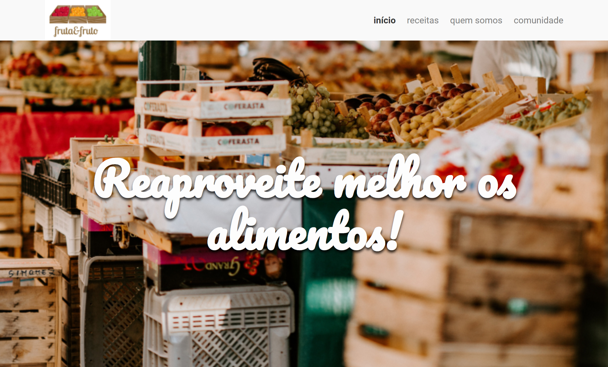

# Fruta & Fruto 🍉

> Arquitetura css

Neste projeto foram utilizados os conceitos de BEM e atomic desing, o curso foi ministrado pela alura.

[🔗 Clique aqui para ver o site hospedado](https://ericodesenvolvedor.github.io/arquitetura-css/)

## 💻 Tecnologia

➡️ HTML5

➡️ CSS3